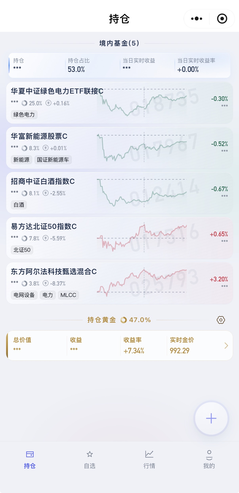
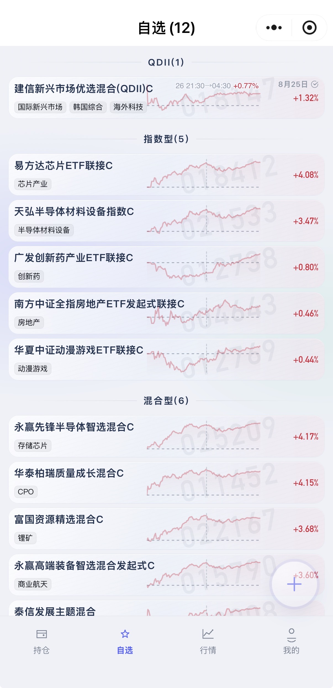
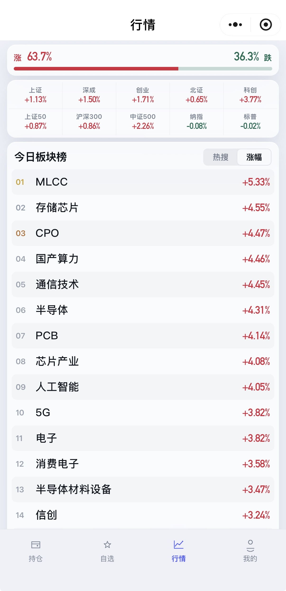
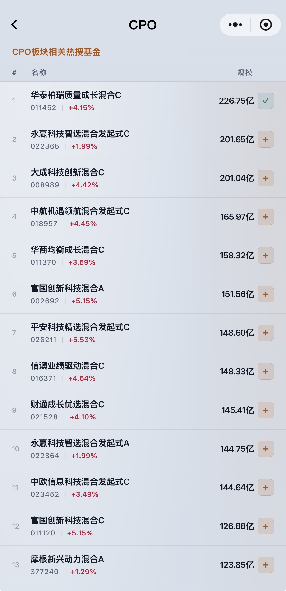
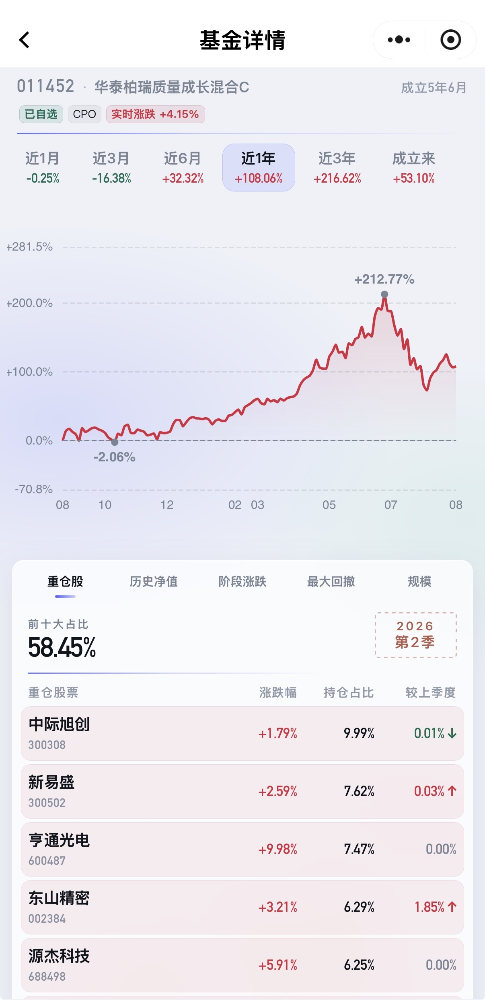
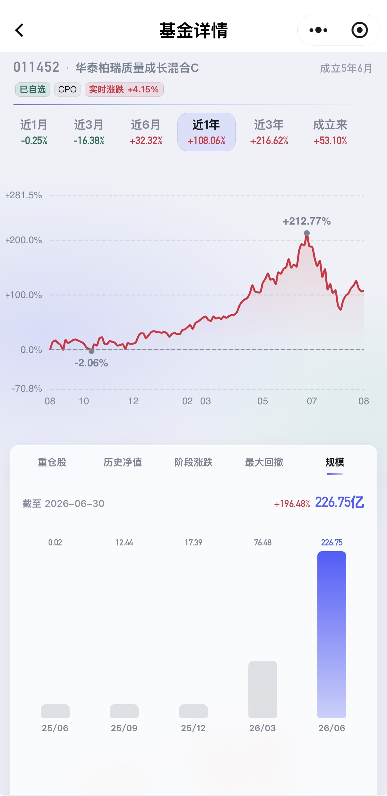
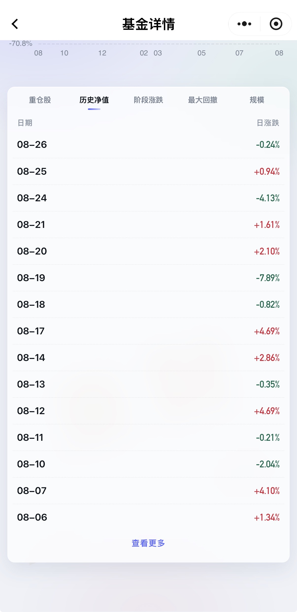
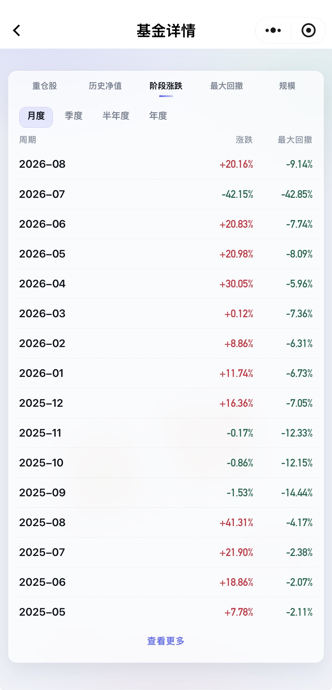

# WZK Fund · 定制化基金看板

个人自建的基金 / 行情看板。开源协议见 [LICENSE](./LICENSE)（MIT）。

多人可共用同一代理服务：行情由服务端转发，**持仓 / 自选 / 黄金 / 开关等个人配置保存在各自小程序本地**，互不串数据。

## 模块

| 模块 | 说明 |
|------|------|
| 持仓列表 | 仅基金：总持仓 / 当日收益 / 收益率；单基金额、收益、涨跌幅、板块标签、占比、估值迷你走势；点名称进基金详情 |
| 黄金 | 独立于基金结算（交易跨日）；实时市值、克数/均价/成本、分时金价；顶部可开关整块面板 |
| 自选基金 | 名称代码、涨跌幅、板块标签、迷你走势；点名称进基金详情 |
| 指数看板 | 上证/深证/创业板/北证50/科创50/上证50/沪深300/中证500/纳斯达克100/标普500 |
| 行情 · 板块 | 涨跌家数；今日板块热搜榜 / 涨幅榜（可滚动全量）；点板块进「板块热搜基金」二级页 |

添加持仓需「代码 + 金额 + 金额口径」；添加自选只需「代码」；名称与板块自动拉取。「我的」可导入/导出完整本地配置。

### 近期能力

| 能力 | 说明 |
|------|------|
| 板块热搜榜 | 行情页按热度排序的今日板块列表；与涨幅榜共用入口、Tab 切换 |
| 板块热搜基金 | 点板块进入二级页，展示该板块相关热搜基金；可加自选、点行进基金详情；支持深浅色 |
| 可点板块标签 | 持仓 / 自选 / 基金详情中的板块标签可跳转对应板块热搜基金页 |
| 基金详情 | 原「基金走势」升级为完整详情页（见下）；持仓 / 自选点基金名或迷你图即可进入 |
| 迷你走势 | 列表估值曲线为原生 canvas 绘制，点位更密，减少折线锯齿 |

**基金详情页**（小程序）主要区块：

| 区块 | 说明 |
|------|------|
| 报头 | 代码、名称、成立时长；可点板块标签 |
| 净值曲线 | 近3月 / 近6月 / 近1年 / 近3年 / 成立来（按成立天数隐藏不可用周期）；周期胶囊展示区间涨跌；曲线高低点；「来财」水印 |
| 重仓股票前十 | 最新报告期前十大重仓；当日涨跌幅、持仓占比、较上季度变化；合计占比与报告季度文案；停留页时约 60s 轮询当日涨跌 |
| 数据看板 | Tab：**历史净值** / **阶段涨幅** / **阶段回撤**；涨幅与回撤可再选粒度（阶段 / 月度 / 季度 / 半年度 / 年度）；列表分页「查看更多」 |

## 界面预览

截图目录：[`screenshot/`](./screenshot/)。

### 首页 Tab

| 持仓 | 自选 |
|:---:|:---:|
|  |  |

| 行情 | 板块热搜基金 |
|:---:|:---:|
|  |  |

### 基金详情

| 净值曲线 · 重仓股 | 规模 |
|:---:|:---:|
|  |  |

| 历史净值 | 阶段涨跌 |
|:---:|:---:|
|  |  |

## 计算逻辑（对齐支付宝口径）

金钱相关计算**只用净值差 / 价格差**，**不用涨跌幅百分比去乘金额**。涨跌幅仅用于展示（标签、分时曲线）。目标与支付宝「份额 × 单位净值差」一致。

### 基金 · 份额与金额口径

录入或修改持仓时选择金额口径，并**必须拉到对应确认净值**后重算份额，本地只保存 `shares`。拉不到净值则保存失败，提示重试。

| 口径 | 你输入的金额含义 | 份额怎么算 | 列表「持仓金额」展示 |
|------|------------------|------------|----------------------|
| 昨日结算 | 昨确认市值 | `金额 ÷ 昨净值` | 按最新确认净值实时计算 |
| 今日结算 | 今确认市值（今净值已出） | `金额 ÷ 今净值` | 按最新确认净值实时计算 |

两种口径都能唯一确定份额；收益一律：

```
收益 = 份额 × (今净值 − 昨净值)
```

口径与净值对齐时，**不会出现「展示金额 / 存储金额各算各的」这种偏差**——持仓金额不存储，只由份额和最新净值派生。

- 昨/今净值来自东财历史单位净值 `DWJZ`（披露值），禁止用两位涨幅反推。
- 份额只按**确认净值**反推，禁止用盘中估值净值。
- 份额保留 4 位小数：`round(金额 / 净值 × 10000) / 10000`。
- 「今日结算」仅在今日净值已确认时可选用；未确认时请用「昨日结算」。

### 基金 · 当日 / 实时收益

```
收益 = 份额 × (今净值 − 昨净值)
```

取分方式与支付宝展示一致：**四舍五入到分**（`decimal.js` `ROUND_HALF_UP`），例如 `-577.665… → -577.67`。

| 时段 | 今净值 | 昨净值 |
|------|--------|--------|
| 确认会话内（净值已出 → 下一交易日开盘前） | 当日披露单位净值 | 上一交易日披露单位净值 |
| 盘中估值 | 估值净值 `forecastNetValue` | 最新确认单位净值 |

汇总：

```
总持仓金额 = Σ 各基金展示市值（确认期：份额×今净值；估值期：份额×昨净值）
当日收益   = Σ 各基金收益
当日收益率 = 当日收益 ÷ Σ(份额 × 昨净值)
```

**不要**使用 `持仓金额 × 涨跌幅%`（两位涨幅会与支付宝差几毛到更多）。

### 基金 · 持仓金额

持仓金额不写入本地配置，也没有每日滚仓步骤。页面刷新时拉取最新净值后实时计算：

```
持仓金额 = 份额 × 最新确认净值
```

因此几天未访问页面不会影响已保存份额；再次打开后用最新净值重新计算展示金额和收益。

### 黄金（独立计算，不并入基金当日收益）

黄金交易跨日，与基金「当日结算」口径不同，故独立板块、不计入持仓汇总。

```
实时市值 = 现价 × 持有克数
成本     = 均价 × 持有克数
收益 = 实时市值 − 成本
```

分时图按真实金价绘制，不用涨跌幅 % 作为主轴。

## 本地配置（小程序）

| 项 | 说明 |
|----|------|
| 存储键 | `wzk-fund-config` |
| 内容 | `settings`（如是否显示黄金）、`funds`（持仓/自选）、`gold`（克数、均价） |
| 服务端 | **不落库**；代理只转发行情；`POST /funds/resolve` 仅解析名称/板块/净值 |

### 添加 / 修改时写什么

1. **添加/编辑持仓**  
   - 调 `resolve` 取今净值、昨净值与日期。  
   - 按所选口径计算 `shares`，连同 `code`、`name` 等写入本地存储。  

2. **删除持仓 / 自选**  
   - 从本地对应条目移除。  

3. **黄金仓位**  
   - 只更新 `gold.holding`、`gold.avgPrice`。  

4. **黄金显示开关 / 主题等**  
   - 写 `settings`（如 `showGold`）。  

5. **行情刷新**  
   - 基金持仓金额和收益只由 `shares` 与最新行情实时计算；刷新不会改写 `shares`。  

6. **导入 / 导出**  
   - 「我的」读写整份 JSON，便于备份与换机。  

换设备或清除小程序缓存会导致配置丢失，请定期导出备份。

## API 摘要

行情代理（无状态，个人组合由客户端传入）：

- `POST /api/funds/quotes` body: `{ type: 'hold'|'watch', funds: [...] }`
- `POST /api/funds/resolve` body: `{ code, type? }` → 名称/板块/今净值/昨净值/净值日（不落库）
- `GET /api/funds/search?code=`
- `POST /api/gold/quote` body: `{ holding, avgPrice }`
- `GET /api/indices`
- `GET /api/indices/:code/history?range=1m|3m|6m|1y|3y`
- `GET /api/market/overview`（涨跌家数 + 板块热搜 / 涨幅榜）
- `GET /api/market/boards?tab=hot|gainers|losers`（板块榜，可选）
- `GET /api/market/boards/funds?sectorCode=&mappingCode=`（板块下热搜基金）
- `GET /api/funds/:code/quote`（单基金行情，含板块标签）

## 数据源

以下均为非官方接口，仅作自建参考；使用前请自行评估对方服务条款：

- 基金估值/分时：天天基金 fund123（search + estimate intraday）
- 基金历史单位净值：东财 `FundMNHisNetList`（`DWJZ`）
- 指数 / 概念板块涨跌：东方财富 push2
- 涨跌家数：东财 NXFXB
- 板块热搜榜、板块关联标签与板块热搜基金：第三方行情接口（服务端聚合；失败时板块涨跌回退东财概念榜）
- 指数历史：腾讯日线 / 新浪 K 线
- AU9999：新浪 `gds_AU9999`（分时优先东财）

## 免责声明

- **非投资建议**：本项目仅供学习与个人自用展示，不构成任何投资、理财或交易建议；据此决策的盈亏由使用者自行承担。
- **数据仅供参考**：行情、估值、涨跌幅、估算收益等来自第三方公开接口的抓取/转发，**非官方授权数据源**，可能延迟、缺失或出错；请以基金公司、交易所及正规行情商披露为准。
- **配置在本机**：个人配置不落服务端；换设备或清缓存会丢失，请用「我的」导出备份。请勿将未加固的代理无限制暴露为公共滥用接口。
- **无担保**：软件按「现状」提供，作者不对可用性、准确性、连续性或适用性作任何明示或默示保证。

## 技术栈

- 小程序：原生微信小程序 + Vant Weapp；详情走势用 ECharts（ec-canvas），列表迷你图用 canvas 2d
- 代理：Node.js + Koa（转发第三方行情；个人配置在客户端本地）

## 微信小程序

原生微信小程序客户端；个人配置存在本机 `wx.storage`（键名 `wzk-fund-config`）。详细说明见 [miniprogram/README.md](./miniprogram/README.md)。

### Tab 页

| Tab | 说明 |
|-----|------|
| 持仓 | 基金汇总（总金额 / 当日收益 / 收益率）；列表含金额、占比、盈亏、涨跌、可点板块标签、迷你走势；点名称或迷你图进基金详情；可选黄金模块；左滑编辑/删除；下拉刷新（阈值 400px）+ 约 30s 静默轮询 |
| 自选 | 自选列表（涨跌、可点板块标签、迷你走势）；点名称或迷你图进基金详情；右下角 FAB 添加；左滑删除；导航标题 `自选(N)`；同样支持下拉刷新与轮询 |
| 行情 | A 股涨跌家数；今日板块热搜 / 涨幅榜（点板块进热搜基金页）；指数网格（上证/深证/创业板/北证50/科创50/上证50/沪深300/中证500/纳斯达克100/标普500 等） |
| 我的 | 黄金显示开关、深色主题；API 地址保存与连通探测；剪贴板导入/导出完整配置；`wzk-fund` 水印 |

### 二级页

| 页面 | 入口 | 说明 |
|------|------|------|
| 基金表单 | 持仓 `+` / 编辑；自选 FAB | `hold`：代码 + 金额 + 金额口径（昨日/今日结算，交易日限制同上文计算逻辑）；`watch`：仅代码 |
| 基金详情 | 持仓/自选名称或迷你图；板块基金列表 | 报头（含可点板块标签）+ 净值曲线；**重仓股票前十**（涨跌 / 占比 / 季变，报告期标注）；下方数据看板（历史净值、阶段涨幅、阶段回撤，多时间粒度与「查看更多」）；详见上文「基金详情页」 |
| 板块热搜基金 | 行情板块行；持仓/自选/详情的板块标签 | 该板块相关热搜基金列表；加自选；点行进基金详情；跟随深浅色主题 |
| 黄金设置 | 持仓黄金区设置 | 持有克数、成本均价；「来财」装饰 |
| 金价走势 | 持仓实时金价 | 分时 / 近1月 / 近3月 / 近6月 / 近1年；价格轴 + 高低点 |
| 指数走势 | 行情指数卡片 | 近1月 / 近3月 / 近6月 / 近1年 / 近3年；样式对齐基金详情 |

### 本地存储与真机

| 键 | 说明 |
|----|------|
| `wzk-fund-config` | funds / gold / settings |
| `wzk-fund-api-base` | 代理地址（默认 `http://127.0.0.1:8787`） |
| `wzk-fund-theme` | `light` / `dark` |
| `holdings_hide_amounts` | 持仓页金额隐藏 |

真机调试请在「我的」将 API 改为电脑局域网 IP，开发者工具勾选不校验合法域名，防火墙放行 8787。

## 目录

| 目录 | 说明 |
|------|------|
| `server/` | 行情代理（Koa，默认 :8787） |
| `miniprogram/` | 微信小程序（用微信开发者工具打开该目录） |
| `screenshot/` | 界面截图 |

## 启动

```bash
# 代理服务 :8787
cd server
npm install
npm run dev

# 微信小程序
cd miniprogram
npm install   # 会打包 Vant 到 miniprogram_npm
# 再用微信开发者工具导入本目录 miniprogram/
```

小程序见 [miniprogram/README.md](./miniprogram/README.md)。
